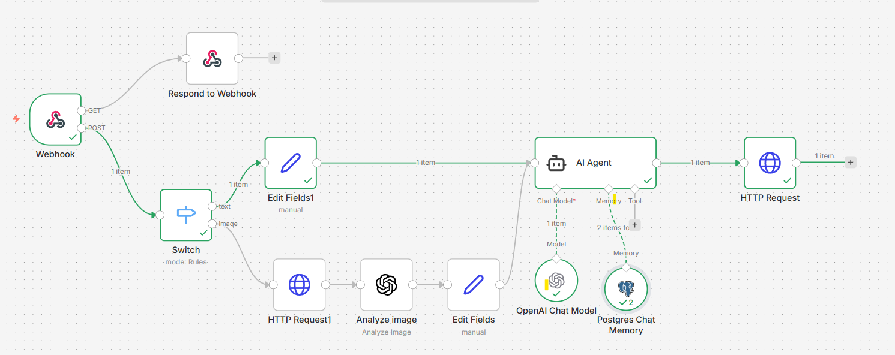

🚀 AI-Powered Multi-Modal Automation Workflow with n8n

Intelligent AI Automation using n8n + OpenAI + Webhooks + Image Analysis + Memory + HTTP Requests

📌 Project Overview

This repository contains a powerful and production-ready AI-powered automation workflow built with n8n.
The workflow intelligently processes incoming webhook requests, detects request types dynamically, analyzes images using AI, stores conversational memory, and generates smart responses using OpenAI-powered AI Agents.

The system combines:

⚡ Real-time webhook automation
🧠 AI Agent orchestration
🖼️ AI image analysis
💬 Conversational memory
🌐 External API communication
🔀 Conditional workflow branching
🤖 OpenAI Chat Model integration

This project demonstrates how modern AI workflows can automate complex business logic while remaining scalable and maintainable.

🧠 Workflow Architecture
🔄 Workflow Flow Overview
Webhook Trigger
      ↓
Switch Node (Route by Request Type)
      ├── Text Branch
      │      ↓
      │   Edit Fields
      │      ↓
      │   AI Agent
      │      ↓
      │   HTTP Request
      │
      └── Image Branch
             ↓
        HTTP Request
             ↓
        Analyze Image
             ↓
        Edit Fields
             ↓
          AI Agent
             ↓
         HTTP Request
⚙️ Detailed Workflow Explanation
1️⃣ Webhook Trigger
🔹 Node: Webhook

The workflow starts when an external application or service sends a request to the webhook endpoint.

Supported Request Types:
Text Input
Image Input
API Payloads
External Automation Requests
Purpose:
Receives incoming data
Initiates automation instantly
Enables real-time AI processing
2️⃣ Webhook Response
🔹 Node: Respond to Webhook

Immediately sends a response back to the requester to ensure fast acknowledgment and better API performance.

Benefits:
Prevents timeout issues
Improves response handling
Enables asynchronous workflow execution
🔀 Intelligent Routing Logic
3️⃣ Switch Node
🔹 Node: Switch

The workflow intelligently detects the incoming request type using rule-based conditions.

Possible Routes:
📝 Text-based requests
🖼️ Image-based requests

This creates a clean and scalable multi-modal AI automation architecture.

📝 Text Processing Branch
4️⃣ Edit Fields (Text Branch)
🔹 Node: Edit Fields1

Prepares and formats incoming text data before sending it to the AI Agent.

Operations:
Data cleanup
Prompt formatting
Metadata preparation
Context structuring
5️⃣ AI Agent Processing
🔹 Node: AI Agent

This is the core intelligence layer of the workflow.

The AI Agent:

Understands user input
Uses conversational memory
Interacts with OpenAI Chat Model
Generates contextual responses
Handles advanced reasoning tasks
6️⃣ OpenAI Chat Model
🔹 Node: OpenAI Chat Model

Provides advanced natural language understanding and response generation.

Capabilities:
Smart conversations
Context-aware replies
AI reasoning
Natural language generation
7️⃣ Memory System
🔹 Node: Postgres Chat Memory

Stores conversational history and contextual memory using PostgreSQL.

Benefits:
Persistent AI memory
Better contextual responses
Session continuity
Long-term conversation handling
8️⃣ HTTP Request (Output/API)
🔹 Node: HTTP Request

Sends AI-generated results to external services, APIs, or applications.

Possible Use Cases:
CRM updates
Chat applications
Notification systems
External integrations
🖼️ Image Processing Branch
9️⃣ HTTP Request (Image Fetching)
🔹 Node: HTTP Request1

Fetches image data or image URLs for AI analysis.

🔟 Analyze Image
🔹 Node: Analyze image

Uses AI-powered image understanding to analyze visual content.

Capabilities:
Image interpretation
Object/content understanding
AI visual reasoning
Multi-modal AI processing
1️⃣1️⃣ Edit Fields (Image Context)
🔹 Node: Edit Fields

Formats analyzed image data before sending it to the AI Agent.

🔗 Integrations Used
Service	Purpose
⚡ n8n	Workflow orchestration
🤖 OpenAI	AI language processing
🌐 Webhook	Real-time trigger system
🖼️ AI Image Analysis	Visual understanding
🗄️ PostgreSQL	Memory storage
🔌 HTTP APIs	External communication
✨ Key Features
⚡ Real-Time Webhook Automation
🤖 AI Agent Orchestration
🧠 Conversational Memory
🖼️ AI Image Understanding
🔀 Conditional Workflow Routing
🌐 API Integration Support
📦 Modular Architecture
🚀 Scalable Workflow Design
🔒 Structured Data Processing
💬 Context-Aware AI Responses
💼 Use Cases
📌 Business Automation

Automate customer support, lead handling, and internal workflows.

📌 AI Chat Systems

Build AI-powered assistants with memory support.

📌 Multi-Modal AI Applications

Handle both text and image inputs intelligently.

📌 API-Based AI Services

Create scalable AI APIs using webhooks.

📌 Smart Workflow Automation

Reduce manual tasks with AI-driven logic.

🛠 Technologies Used
n8n
OpenAI API
PostgreSQL
HTTP APIs
Webhooks
AI Agent Architecture
Image Analysis AI
📂 Recommended Repository Structure
📦 ai-n8n-workflow
 ┣ 📂 assets
 ┃ ┗ 📜 workflow-screenshot.png
 ┣ 📂 workflow
 ┃ ┗ 📜 workflow.json
 ┣ 📜 README.md
 ┗ 📜 LICENSE
📸 Workflow Screenshot
Main Workflow Preview

Add your workflow screenshot here.

